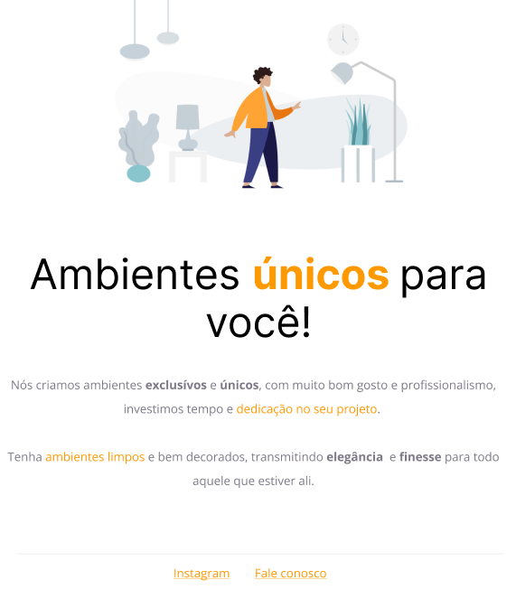

<h1 align="center"> Projeto Móveis Customizados </h1>

  <a href="#-tecnologias">Tecnologias</a>&nbsp;&nbsp;&nbsp;|&nbsp;&nbsp;&nbsp;
  <a href="#-projeto">Projeto</a>&nbsp;&nbsp;&nbsp;|&nbsp;&nbsp;&nbsp;
  <a href="#-layout">Layout</a>&nbsp;&nbsp;&nbsp;|&nbsp;&nbsp;&nbsp;

  

 

  

## 🚀 Tecnologias

Esse projeto foi desenvolvido com as seguintes tecnologias:

- HTML e CSS
- Git e Github
- Figma

## 💻 Projeto

O Móveis Customizados é um projeto que tem como finalidade o desenvolvimento inicial de HTML e CSS.

- [Acesse o projeto finalizado, online](https://maykbrito.github.io/devlinks)

## 🔖 Layout

Você pode visualizar o layout do projeto através [DESSE LINK](<https://www.figma.com/file/hFOxM7YZddEk8Pmc7gijAh/Explorer---Projeto-01-(Copy)?type=design&node-id=1%3A3&mode=dev>). É necessário ter conta no [Figma](https://figma.com) para acessá-lo.
